# Palm Vision Soul Guide 🔮✋

A modern web application that provides AI-powered palm reading analysis and spiritual guidance through interactive chat. Users can upload palm images to receive detailed palmistry insights and engage with an AI guide for personalized spiritual advice.

## 📑 Table of Contents

1. [Overview](#overview)
2. [Features](#features)
3. [Technology Stack](#technology-stack)
4. [Architecture](#architecture)
5. [Project Structure](#project-structure)
6. [Core Components](#core-components)
7. [Database Schema](#database-schema)
8. [API Functions](#api-functions)
9. [Setup & Installation](#setup--installation)
10. [Development](#development)
11. [Deployment](#deployment)
12. [Contributing](#contributing)

## 🌟 Overview

Palm Vision Soul Guide combines ancient palmistry wisdom with modern AI technology to provide users with:

- **AI-Powered Palm Analysis**: Upload palm images for detailed readings covering life path, career, relationships, health, and spiritual aspects
- **Interactive Chat Interface**: Engage with an AI guide for personalized insights and spiritual guidance
- **User Profile Management**: Maintain personal information for enhanced reading accuracy
- **Secure Data Storage**: All images and analysis stored securely with Supabase

## ✨ Features

### Core Features
- 📸 **Palm Image Upload & Analysis**: Upload palm photos with automatic image compression and quality validation
- 🤖 **AI-Powered Palmistry**: Advanced OpenAI vision models analyze palm lines, mounts, and characteristics
- 💬 **Contextual Chat**: Chat with AI guide that remembers your palm reading and provides personalized advice
- 👤 **User Authentication**: Secure authentication system with Supabase Auth
- 📊 **Detailed Reports**: Comprehensive palm reading reports with scores and explanations
- 📱 **Responsive Design**: Mobile-first responsive UI with dark/light theme support

### Technical Features
- 🔐 **Secure File Storage**: Images stored in Supabase Storage with public URL generation
- 🚀 **Serverless Functions**: Edge functions for AI processing and chat functionality
- 📈 **Real-time Progress**: Live progress tracking during palm analysis
- 🎨 **Modern UI**: Built with shadcn/ui components and Tailwind CSS
- 🔍 **Type Safety**: Full TypeScript implementation with proper type definitions

## 🛠 Technology Stack

### Frontend
- **React 18** - Modern React with hooks and functional components
- **TypeScript** - Type-safe development with full IDE support
- **Vite** - Fast build tool and development server
- **React Router** - Client-side routing with protected routes
- **Tailwind CSS** - Utility-first CSS framework for styling
- **shadcn/ui** - High-quality accessible UI components
- **Radix UI** - Headless UI primitives for complex components
- **React Query** - Data fetching and state management
- **React Hook Form** - Form handling with validation
- **Zod** - Schema validation for forms and API responses

### Backend & Infrastructure
- **Supabase** - Backend-as-a-Service platform providing:
  - PostgreSQL database
  - Authentication system
  - File storage
  - Edge Functions (Deno/TypeScript)
  - Real-time subscriptions
- **OpenAI API** - AI models for image analysis and chat responses
- **Deno** - Runtime for serverless edge functions

### Development Tools
- **ESLint** - Code linting and style enforcement
- **PostCSS** - CSS processing with Tailwind
- **Bun** - Fast package manager and runtime

## 🏗 Architecture

### High-Level Architecture

```mermaid
graph TB
    User[👤 User]
    
    subgraph "Client Side"
        Frontend[React Frontend Application<br/>Web Browser]
    end
    
    subgraph "Supabase Cloud"
        EdgeFunctions[Supabase Edge Functions<br/>Deno/TypeScript]
        Database[(Supabase Database<br/>PostgreSQL)]
        Storage[(Supabase Storage<br/>Object Storage)]
    end
    
    OpenAI[OpenAI API<br/>External System]
    
    %% User interactions
    User --> Frontend
    
    %% Frontend to Supabase services
    Frontend <--> EdgeFunctions
    Frontend <--> Database
    Frontend <--> Storage
    
    %% Edge Functions interactions
    EdgeFunctions <--> OpenAI
    EdgeFunctions <--> Database
    
    %% Styling
    classDef user fill:#4A4A8A,stroke:#2F2F57,color:#FFFFFF
    classDef frontend fill:#6A99D8,stroke:#336699,color:#000000
    classDef supabase fill:#40E0D0,stroke:#20B2AA,color:#000000
    classDef external fill:#D3D3D3,stroke:#A0A0A0,color:#000000
    
    class User user
    class Frontend frontend
    class EdgeFunctions,Database,Storage supabase
    class OpenAI external
```



### Component Architecture
The application follows a modular component-based architecture:

- **Authentication Layer**: Controls access to protected features
- **State Management**: React Query for server state, React hooks for local state
- **UI Layer**: Reusable components with shadcn/ui foundation
- **API Layer**: Supabase client with edge functions for AI processing
- **Storage Layer**: Supabase storage for images, PostgreSQL for structured data

## 📁 Project Structure

```
palm-vision-soul-guide/
├── 📄 Configuration Files
│   ├── package.json              # Dependencies and scripts
│   ├── vite.config.ts           # Vite build configuration
│   ├── tailwind.config.ts       # Tailwind CSS configuration
│   ├── tsconfig.json            # TypeScript configuration
│   ├── eslint.config.js         # ESLint linting rules
│   ├── postcss.config.js        # PostCSS configuration
│   └── components.json          # shadcn/ui component configuration
│
├── 🌐 Frontend Source (src/)
│   ├── 📱 Core Application
│   │   ├── App.tsx              # Main app component with routing
│   │   ├── main.tsx             # Application entry point
│   │   ├── index.css            # Global styles and Tailwind imports
│   │   └── vite-env.d.ts        # Vite type definitions
│   │
│   ├── 📄 Pages (pages/)
│   │   ├── Index.tsx            # Main application page with state management
│   │   ├── Landing.tsx          # Landing page for new visitors
│   │   └── NotFound.tsx         # 404 error page
│   │
│   ├── 🧩 Components (components/)
│   │   ├── 🔐 Authentication
│   │   │   └── Auth.tsx         # Login/signup forms and authentication UI
│   │   │
│   │   ├── 📸 Palm Reading
│   │   │   ├── PalmUpload.tsx   # Image upload with camera/file selection
│   │   │   ├── PalmImagePreview.tsx  # Image preview with blur effect
│   │   │   └── PalmReadingProgress.tsx  # Progress indicator during analysis
│   │   │
│   │   ├── 📊 Palmistry Reports (palmistry_report/)
│   │   │   ├── PalmistryReport.tsx      # Main report container
│   │   │   ├── OverviewPage.tsx         # Overview tab with summary
│   │   │   ├── DetailedAnalysisPage.tsx # Detailed analysis tab
│   │   │   └── InsightsSummaryPage.tsx  # Insights and recommendations
│   │   │
│   │   ├── 💬 Chat System
│   │   │   └── ChatInterface.tsx # AI chat interface with message history
│   │   │
│   │   ├── 👤 User Management
│   │   │   └── UserProfile.tsx   # User profile form and management
│   │   │
│   │   ├── 🎨 UI Components (ui/)
│   │   │   ├── button.tsx        # Customizable button component
│   │   │   ├── card.tsx          # Card container component
│   │   │   ├── dialog.tsx        # Modal dialog component
│   │   │   ├── form.tsx          # Form components with validation
│   │   │   ├── input.tsx         # Input field component
│   │   │   ├── progress.tsx      # Progress bar component
│   │   │   ├── tabs.tsx          # Tab navigation component
│   │   │   ├── toast.tsx         # Toast notification system
│   │   │   └── [30+ other UI components]
│   │   │
│   │   └── BlurImage.tsx         # Optimized image component with blur loading
│   │
│   ├── 🎣 Hooks (hooks/)
│   │   ├── useAuth.tsx           # Authentication state and functions
│   │   ├── useCompressedImage.ts # Image compression utility
│   │   ├── use-mobile.tsx        # Mobile device detection
│   │   └── use-toast.ts          # Toast notification hook
│   │
│   ├── 🔌 Integrations (integrations/)
│   │   └── supabase/
│   │       ├── client.ts         # Supabase client configuration
│   │       └── types.ts          # Database type definitions (auto-generated)
│   │
│   └── 📚 Utilities (lib/)
│       └── utils.ts              # Utility functions (cn, clsx helpers)
│
├── 🗄️ Backend (supabase/)
│   ├── config.toml               # Supabase project configuration
│   │
│   ├── ⚡ Edge Functions (functions/)
│   │   ├── generate-palm-reading/
│   │   │   └── index.ts          # Palm image analysis with OpenAI Vision
│   │   └── chat-with-ai/
│   │       └── index.ts          # AI chat responses with context
│   │
│   └── 📊 Database (migrations/)
│       ├── [timestamp]-initial-schema.sql     # Users and auth tables
│       └── [timestamp]-palm-reading-tables.sql # Palm readings and chat tables
│
└── 🌐 Static Assets (public/)
    ├── favicon.ico               # Application favicon
    ├── placeholder.svg           # Placeholder image
    ├── robots.txt               # Search engine robots file
    └── lovable-uploads/         # User uploaded images
```

## 🧩 Core Components

### Authentication System (`src/components/Auth.tsx`)
- **Purpose**: Handles user registration and login
- **Features**: Email/password authentication, form validation, error handling
- **Integration**: Supabase Auth with automatic session management
- **UI**: Modal-based forms with responsive design

### Palm Upload (`src/components/PalmUpload.tsx`)
- **Purpose**: Image capture and upload functionality
- **Features**: 
  - Camera access for direct photo capture
  - File upload from device gallery
  - Automatic image compression (max 800px width)
  - Real-time preview with quality validation
- **Storage**: Uploads to Supabase Storage with unique file naming
- **Error Handling**: File type validation, size limits, upload error recovery

### Palm Reading Display

The palm reading display functionality is handled directly by the **Palmistry Report** component (`src/components/palmistry_report/PalmistryReport.tsx`), which provides a comprehensive tabbed interface for displaying AI-generated palm analysis results.

### Palmistry Report (`src/components/palmistry_report/PalmistryReport.tsx`)
- **Purpose**: Main component for displaying comprehensive palm reading results
- **Features**:
  - Structured display of life path, career, relationships, health, spiritual scores
  - Visual progress indicators for each aspect
  - Detailed descriptions and recommendations
  - Tabbed interface for organized presentation
- **Components**:
  - `OverviewPage.tsx`: Summary scores and key insights
  - `DetailedAnalysisPage.tsx`: In-depth analysis of each palm aspect
  - `InsightsSummaryPage.tsx`: Recommendations and life guidance
- **Navigation**: Tab-based interface with smooth transitions
- **Data**: Renders JSON analysis from OpenAI API response

### Chat Interface (`src/components/ChatInterface.tsx`)
- **Purpose**: Interactive AI chat for personalized guidance
- **Features**:
  - Real-time message sending and receiving
  - Chat history persistence
  - Context awareness (remembers palm reading)
  - Typing indicators and message timestamps
- **AI Integration**: Uses OpenAI GPT models with palm reading context

### User Profile (`src/components/UserProfile.tsx`)
- **Purpose**: Collect and manage user information for accurate readings
- **Fields**:
  - Date of birth (for astrological insights)
  - Hand preference (dominant hand analysis)
  - Gender (for reading interpretation)
- **Validation**: Form validation with Zod schemas
- **Storage**: Profile data stored in Supabase database

## 📊 Database Schema


### Table Details

#### `users` (Supabase Auth)
- **Purpose**: Core user authentication and profile data
- **Key Fields**:
  - `id`: UUID primary key (linked to Supabase auth.users)
  - `email`: User's email address
  - `user_profile`: JSONB containing date of birth, hand preference, gender
- **Security**: RLS policies restrict access to own data

#### `palm_readings`
- **Purpose**: Store palm analysis results and images
- **Key Fields**:
  - `user_id`: Links to authenticated user
  - `palm_image_url`: Public URL to image in Supabase Storage
  - `analysis_data`: JSONB containing complete OpenAI analysis response
- **Relationships**: One user can have multiple palm readings

#### `chat_sessions`
- **Purpose**: Group related chat conversations
- **Key Fields**:
  - `palm_reading_id`: Optional link to specific palm reading for context
  - `title`: Auto-generated or user-defined session title
- **Usage**: Enables chat history organization and context retention

#### `chat_messages`
- **Purpose**: Individual chat messages with full conversation history
- **Key Fields**:
  - `message_type`: 'user' or 'assistant' to differentiate message sender
  - `content`: Message text content
- **Features**: Chronological ordering, full conversation persistence

## ⚡ API Functions

### Palm Reading Generation (`supabase/functions/generate-palm-reading/index.ts`)

**Purpose**: Analyzes uploaded palm images using OpenAI Vision API

**Process Flow**:
1. **Image Validation**: Checks if uploaded image contains a clear, readable palm
2. **User Context**: Incorporates user profile data (age, hand preference, gender)
3. **AI Analysis**: Sends image to OpenAI GPT-4 Vision with detailed palmistry prompts
4. **Response Processing**: Structures AI response into standardized JSON format
5. **Database Storage**: Saves analysis results linked to user

**Key Features**:
- **Quality Control**: Rejects blurry, unclear, or non-palm images
- **Detailed Prompts**: Comprehensive instructions for accurate palmistry analysis
- **Error Handling**: Graceful handling of API failures and invalid responses
- **Structured Output**: Consistent JSON schema for frontend consumption

**Response Schema**:
```typescript
{
  lifePath: { score: number, description: string },
  career: { score: number, description: string },
  relationships: { score: number, description: string },
  health: { score: number, description: string },
  spiritual: { score: number, description: string },
  summary: string,
  recommendations: string[]
}
```

### Chat AI Function (`supabase/functions/chat-with-ai/index.ts`)

**Purpose**: Provides contextual AI chat responses based on palm readings and user profile

**Context Building**:
- **Palm Reading Context**: Includes previous analysis scores and descriptions
- **User Profile**: Incorporates birth date, hand preference, and gender
- **Chat History**: Maintains conversation continuity with recent message history
- **Personality**: Warm, empathetic spiritual guide persona

**Features**:
- **Context Awareness**: References specific palm reading details in responses
- **Conversation Memory**: Maintains chat history for natural dialogue flow
- **Personalization**: Tailors advice based on user's unique palm analysis
- **Message Persistence**: Stores all messages for future reference

**Process Flow**:
1. Receive user message and extract context (palm reading, profile, history)
2. Build comprehensive prompt with all relevant context
3. Send to OpenAI GPT model for response generation
4. Store both user message and AI response in database
5. Return AI response to frontend

## Palm Reading Process Flow


## Chat Process Flow


## 🚀 Setup & Installation

### Prerequisites
- **Node.js** (v18 or higher)
- **Bun** (recommended) or npm
- **Supabase** account and project
- **OpenAI API** key

### Environment Setup

1. **Clone the repository**:
```bash
git clone <repository-url>
cd palm-vision-soul-guide
```

2. **Install dependencies**:
```bash
bun install
# or
npm install
```

3. **Environment Variables**:
Create `.env.local` file in root directory:
```env
VITE_SUPABASE_URL=your_supabase_project_url
VITE_SUPABASE_ANON_KEY=your_supabase_anon_key
```

4. **Supabase Setup**:
- Create new Supabase project
- Run migrations to set up database schema
- Configure authentication settings
- Set up storage bucket for images
- Add OpenAI API key to edge function secrets

5. **OpenAI Setup**:
- Obtain OpenAI API key
- Add to Supabase edge function environment variables

### Database Migration

```bash
# Install Supabase CLI
npm install -g supabase

# Link to your project
supabase link --project-ref your-project-ref

# Run migrations
supabase db push
```

## 🔧 Development

### Development Server
```bash
bun run dev
# or
npm run dev
```
Application will be available at `http://localhost:5173`

### Building for Production
```bash
bun run build
# or
npm run build
```

### Code Quality
```bash
# Run linting
bun run lint
# or
npm run lint
```

### Project Scripts

- `dev`: Start development server with hot reload
- `build`: Create production build
- `build:dev`: Create development build
- `lint`: Run ESLint for code quality
- `preview`: Preview production build locally

## 🚀 Deployment

### Frontend Deployment
The React application can be deployed to any static hosting service:

- **Vercel** (recommended for Vite projects)
- **Netlify**
- **Firebase Hosting**
- **GitHub Pages**

### Backend Deployment
Backend services are deployed through Supabase:

1. **Edge Functions**: Deploy via Supabase CLI
```bash
supabase functions deploy generate-palm-reading
supabase functions deploy chat-with-ai
```

2. **Database**: Automatically managed by Supabase
3. **Storage**: Configured through Supabase dashboard

### Environment Configuration
Ensure production environment variables are set:
- Supabase project URL and keys
- OpenAI API key (in Supabase secrets)
- CORS settings for your domain

## 🤝 Contributing

### Development Guidelines

1. **Code Style**: Follow TypeScript and React best practices
2. **Component Structure**: Use functional components with hooks
3. **Type Safety**: Maintain full TypeScript coverage
4. **UI Consistency**: Use shadcn/ui components and Tailwind CSS
5. **Testing**: Write tests for critical functionality
6. **Documentation**: Update README and inline comments

### Pull Request Process

1. Fork the repository
2. Create feature branch: `git checkout -b feature/amazing-feature`
3. Commit changes: `git commit -m 'Add amazing feature'`
4. Push to branch: `git push origin feature/amazing-feature`
5. Open Pull Request with detailed description

### Issues and Bugs

- Report bugs through GitHub Issues
- Include detailed reproduction steps
- Provide browser and device information
- Add screenshots for UI-related issues

---

## 📝 Additional Notes for AI Agents

### Key File Locations for Analysis

- **Main Application Entry**: `src/main.tsx` and `src/App.tsx`
- **Core Page Logic**: `src/pages/Index.tsx` (contains main application state)
- **Authentication Logic**: `src/hooks/useAuth.tsx`
- **API Integration**: `src/integrations/supabase/client.ts`
- **Type Definitions**: `src/integrations/supabase/types.ts`
- **UI Components**: `src/components/ui/` (shadcn/ui components)
- **Business Logic**: `src/components/` (feature-specific components)
- **Backend Functions**: `supabase/functions/` (edge functions)

### State Management Pattern
- **Server State**: React Query for API data fetching and caching
- **Local State**: React useState and useReducer hooks
- **Global State**: Context providers for authentication and theme
- **Form State**: React Hook Form with Zod validation

### API Integration Pattern
- **Client**: Supabase JavaScript client for database operations
- **Authentication**: Supabase Auth with automatic session management
- **File Upload**: Direct upload to Supabase Storage with public URLs
- **AI Processing**: Edge functions that call OpenAI API
- **Real-time**: Potential for Supabase real-time subscriptions

### Code Organization Philosophy
- **Feature-based**: Components organized by feature area
- **Reusable UI**: Shared UI components in `ui/` directory
- **Type Safety**: Comprehensive TypeScript usage throughout
- **Separation of Concerns**: Clear separation between UI, logic, and data layers
- **Modern React**: Hooks-based functional components throughout

This documentation serves as both human-readable project documentation and a comprehensive guide for AI agents to understand the project structure, functionality, and codebase organization.
