# Palmistry Application Architecture

## Overview
This document provides visual representations of the application's architecture and data flow using Mermaid diagrams.

## 1. High-Level Architecture
This diagram illustrates the main software components of the system, their interactions, and general data flows, with a focus on visual clarity.

```mermaid
graph TB
    User[👤 User]
    
    subgraph "Client Side"
        Frontend[React Frontend Application<br/>Web Browser]
    end
    
    subgraph "Supabase Cloud"
        EdgeFunctions[Supabase Edge Functions<br/>Deno/TypeScript]
        Database[(Supabase Database<br/>PostgreSQL)]
        Storage[(Supabase Storage<br/>Object Storage)]
    end
    
    OpenAI[OpenAI API<br/>External System]
    
    %% User interactions
    User --> Frontend
    
    %% Frontend to Supabase services
    Frontend <--> EdgeFunctions
    Frontend <--> Database
    Frontend <--> Storage
    
    %% Edge Functions interactions
    EdgeFunctions <--> OpenAI
    EdgeFunctions <--> Database
    
    %% Styling
    classDef user fill:#4A4A8A,stroke:#2F2F57,color:#FFFFFF
    classDef frontend fill:#6A99D8,stroke:#336699,color:#000000
    classDef supabase fill:#40E0D0,stroke:#20B2AA,color:#000000
    classDef external fill:#D3D3D3,stroke:#A0A0A0,color:#000000
    
    class User user
    class Frontend frontend
    class EdgeFunctions,Database,Storage supabase
    class OpenAI external
```

### High-Level Architecture Explanation
This diagram visualizes the primary software components of the Palmistry application and how they interact. It focuses on the logical components and their communication paths.

-   **User**: The individual interacting with the application.
-   **React Frontend Application**: The client-side web application (running in the user's browser) responsible for the user interface, interaction, and orchestrating calls to backend services.
-   **Supabase Cloud**: This logical grouping encompasses the core backend services provided by Supabase:
    -   **Supabase Edge Functions**: Serverless components (Deno/TypeScript) that contain the main business logic, particularly for integrating with AI services (like palm analysis and chat).
    -   **Supabase Database**: The PostgreSQL database that acts as the persistent data store for all structured application data (user profiles, palm readings, chat history).
    -   **Supabase Storage**: The object storage service specifically used for storing user-uploaded palm images.
-   **OpenAI API**: An external component that provides advanced Artificial Intelligence capabilities for both image analysis and generating conversational text.

#### Component Interactions & Data Flow:
-   The **User** directly interacts with the **React Frontend Application**.
-   The **React Frontend Application** communicates with the **Supabase Cloud** services:
    -   It **invokes** **Supabase Edge Functions** for processing requests that require server-side AI logic (e.g., sending image data for analysis, sending chat messages).
    -   It **manages data** in the **Supabase Database** (e.g., reading/writing user profiles, chat sessions/messages) typically via the Supabase Client SDK.
    -   It **manages files** by uploading user palm images to **Supabase Storage** and later retrieving their public URLs.
-   **Supabase Edge Functions** are central to backend processing:
    -   They **request AI** analysis and chat responses from the **OpenAI API**.
    -   They **read from and write to** the **Supabase Database** to store generated palm readings and maintain chat history.
-   The **OpenAI API** returns AI responses (analysis, chat replies) back to the **Supabase Edge Functions**.
-   Data (user profiles, palm readings, chat history) is **provided** from the **Supabase Database** to both the **Supabase Edge Functions** and the **React Frontend Application**.
-   Public **Image URLs** are **provided** from **Supabase Storage** to the **React Frontend Application** to display uploaded images.

## 2. Palm Reading Process
Detailed flow of the palm reading generation process.

### Palm Reading Process Explanation
1. **Image Upload**
   - User selects palm image
   - Image is stored in Supabase Storage
   - Image is converted to base64 format

2. **Processing**
   - Edge Function receives image and user profile
   - OpenAI analyzes the palm image
   - Analysis is stored in database

3. **Response**
   - Reading is returned to frontend
   - User sees detailed palm analysis

## 3. Chat Process
Detailed flow of the AI chat interaction process.

### Chat Process Explanation
1. **Message Flow**
   - User sends message to frontend
   - Frontend forwards to Edge Function
   - Edge Function stores user message in database

2. **Context Management**
   - Chat history is retrieved
   - Palm reading context is included
   - User profile is considered

3. **AI Response**
   - OpenAI generates response
   - Response is stored in database
   - User sees AI reply

## Database Schema
Key tables and their relationships.

### Database Schema Explanation
- **Users**: Core user information
- **Palm Readings**: Stores palm analysis results
- **Chat Sessions**: Groups related conversations
- **Chat Messages**: Individual messages in sessions